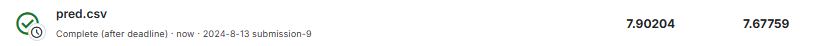
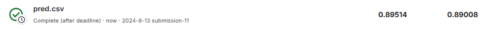

# HW-01 2021-Spring 完成记录

## 说在前面

作为本门课程的第一个作业,也是我接触的第一个深度学习项目

## Data Analysis

本作业提供了两个文件

- covid.train.csv 训练集
- covid.test.csv  测试集

打开 `covid.train.csv` 可以看到训练集数据，一共有95列。第1列为ID号，2-41列为 课件中所说的 one-hot-vector 的数据表示该病例是属于哪个state，后面的数据则为跟新冠有关的信息，仔细观察可以发现是三天的新冠诊断数据。

打开 `covid.test.csv` 可以看到测试集数据，一共94列。格式与 `covid.train.csv` 一致，缺少95列 第三天的 tested_postive 的数据，这一列便是题目要求我们预测的数据。

另外因为没有提供验证集, 我们需要自行从训练集中划分验证集, 并使用划分后的训练集和验证集来完成交叉验证,提高准确性,从而达到更低的private score. 

## Simple Baseline

**simple baseline score : 2.03004**

成功运行课程提供的sample code，提交其预测结果即可达到simple baseline.


## Medium Baseline

**medium baseline score: 1.28359**

> 课程slide的提示
>
> Feature selection: 40 states + 2 `tested_positive` (`TODO` in dataset)

根据提示我们在sample code中的Dataset 函数中增加Feature selection的功能，筛选的特征为40 states + 2 `tested_positive` ，即40个洲和2天的检验阳性。

**提醒：**

1. 启用 feature selection 功能，需将 target_only变量设为 True，请仔细检查训练时该变量的值是否为 True.
2. 在读取csv文件时，已自动去除第一行（列名）和第一列（id），并转换为numpy数组，意味着剩下的列号是从0开始计数的.

```python
class COVID19Dataset(Dataset):
    ''' Dataset for loading and preprocessing the COVID19 dataset '''
    def __init__(self,
                 path,
                 mode='train',
                 target_only=True):
        self.mode = mode

        # Read data into numpy arrays
        with open(path, 'r') as fp:
            data = list(csv.reader(fp))
            data = np.array(data[1:])[:, 1:].astype(float) # remove the first row and first line

        if not target_only:
            feats = list(range(93))
        else:
            # TODO: Using 40 states & 2 tested_positive features (indices = 57 & 75)
            feats = list(range(40)) + [57, 75]
            pass

        if mode == 'test':
            # Testing data
            # data: 893 x 93 (40 states + day 1 (18) + day 2 (18) + day 3 (17))
            data = data[:, feats]
            self.data = torch.FloatTensor(data)
        else:
            # Training data (train/dev sets)
            # data: 2700 x 94 (40 states + day 1 (18) + day 2 (18) + day 3 (18))
            target = data[:, -1]
            data = data[:, feats]

            # Splitting training data into train & dev sets
            if mode == 'train':
                indices = [i for i in range(len(data)) if i % 10 != 0]
            elif mode == 'dev':
                indices = [i for i in range(len(data)) if i % 10 == 0]

            # Convert data into PyTorch tensors
            self.data = torch.FloatTensor(data[indices])
            self.target = torch.FloatTensor(target[indices])

        # Normalize features (you may remove this part to see what will happen)
        self.data[:, 40:] = \
            (self.data[:, 40:] - self.data[:, 40:].mean(dim=0, keepdim=True)) \
            / self.data[:, 40:].std(dim=0, keepdim=True)

        self.dim = self.data.shape[1]

        print('Finished reading the {} set of COVID19 Dataset ({} samples found, each dim = {})'
              .format(mode, len(self.data), self.dim))

```

修改后进行训练，将预测结果提交平台结果如下，达到medium baseline.


## **Strong Baseline**

**strong baseline score: 0.88017**

> 课程slide的提示
>
> * Feature selection (what other features are useful?)
> * DNN architecture (layers? dimension? activation function?)
> * Training (mini-batch? optimizer? learning rate?)
> * L2 regularization
> * There are some mistakes in the sample code, can you find them?

**我就按照课程的提示依次来改进模型**

### 1. Feature Selection 特征选择 

> 参考资料：[特征选择方法最全总结！-CSDN博客](https://blog.csdn.net/Datawhale/article/details/120582526)

**特征选择的部分作用：**

● 减少训练数据大小，加快模型训练速度。

● 减少模型复杂度，避免过拟合。

● 特征数少，有利于解释模型。

● 如果选择对的特征子集，模型准确率可能会提升

● 去除冗余无用特征，减低模型学习难度，减少数据噪声。

● 去除标注性强的特征，例如某些特征在训练集和测试集分布严重不一致，去除他们有利于避免过拟合。

我们使用Feature Selection顺利地通过了 Medium Baseline 。我们应该选择与预测结果高度相关的特征用于训练，但是我们并不知道在过 medium baseline 时我们选取的特征是否是最相关的，所以我们应该完善我们的 Feature Selection.

**特征选择思路：**

- 使用sklearn的feature_selection工具中的f_regression方法，计算得出与目标显著相关的特征。
- 选取相关性高的特征（由高到低选取，个数需要实践根据实践效果判断）

在sample code 中增加 Feature Selection 模块

```python
import pandas as pd
from sklearn.feature_selection import SelectKBest, f_regression

# 读取数据
data = pd.read_csv(r'./covid.train.csv')  # 读取CSV文件
x = data[data.columns[1:94]]  # 选择特征列（第2列到第94列），第1列是非特征列 id
y = data[data.columns[94]]  # 选择目标列（第95列）

# 特征归一化
x = (x - x.min()) / (x.max() - x.min())  # 将特征值缩放到0到1之间

# 创建SelectKBest实例
bestfeatures = SelectKBest(score_func=f_regression)  # 选择K个最佳特征，这里使用f_regression作为评分函数

# 计算所有特征的分数
fit = bestfeatures.fit(x, y)  # 计算每个特征的分数

# 将分数转换为DataFrame
dfscores = pd.DataFrame(fit.scores_)  # 将特征分数转换为DataFrame格式

# 创建包含特征名称的DataFrame
dfcolumns = pd.DataFrame(x.columns)  # 将特征列名转换为DataFrame格式

# 将两个DataFrame进行合并以便于可视化
featureScores = pd.concat([dfcolumns, dfscores], axis=1)  # 合并特征名称和分数DataFrame

# 为合并后的DataFrame命名列
featureScores.columns = ['Specs', 'Score']  # 将列名设置为'Specs'和'Score'

# 打印前20个分数最高的特征
print(featureScores.nlargest(20, 'Score'))  # 显示得分最高的20个特征

# 打印得分最高特征的索引
top_rows = featureScores.nlargest(20, 'Score').index.tolist()[:17]  # 获取得分最高的前17个特征的索引
print(top_rows)  # 打印这些特征的索引
```

运行结果如下：


根据评分结果，我们会选取前14位作为我们使用的特征，因为从15位开始得分差距较大。但是根据我们的实践结果显示选择前17位效果更好

修改Dataset模块代码，选取前17位特征进行训练。

```python
class COVID19Dataset(Dataset):
    ''' Dataset for loading and preprocessing the COVID19 dataset '''
    def __init__(self,
                 path,
                 mode='train',
                 target_only=True):
        self.mode = mode

        # Read data into numpy arrays
        with open(path, 'r') as fp:
            data = list(csv.reader(fp))
            data = np.array(data[1:])[:, 1:].astype(float) # remove the first row and first line

        if not target_only:
            feats = list(range(93))
        else:
            # TODO: Feature selection
            # You can use the following code to get feature scores
            feats = [75, 57, 42, 60, 78, 43, 61, 79, 40, 58, 76, 41, 59, 77, 92, 74, 56]
            pass

        if mode == 'test':
            # Testing data
            # data: 893 x 93 (40 states + day 1 (18) + day 2 (18) + day 3 (17))
            data = data[:, feats]
            self.data = torch.FloatTensor(data)
        else:
            # Training data (train/dev sets)
            # data: 2700 x 94 (40 states + day 1 (18) + day 2 (18) + day 3 (18))
            target = data[:, -1]
            data = data[:, feats]

            # Splitting training data into train & dev sets
            if mode == 'train':
                indices = [i for i in range(len(data)) if i % 10 != 0]
            elif mode == 'dev':
                indices = [i for i in range(len(data)) if i % 10 == 0]

            # Convert data into PyTorch tensors
            self.data = torch.FloatTensor(data[indices])
            self.target = torch.FloatTensor(target[indices])

        # Normalize features (you may remove this part to see what will happen)
        self.data[:, 40:] = \
            (self.data[:, 40:] - self.data[:, 40:].mean(dim=0, keepdim=True)) \
            / self.data[:, 40:].std(dim=0, keepdim=True)

        self.dim = self.data.shape[1]

        print('Finished reading the {} set of COVID19 Dataset ({} samples found, each dim = {})'
              .format(mode, len(self.data), self.dim))
```

修改后，重新训练模型，提交结果发现效果并不好，我们暂时保留特征选择的结果，继续后面的操作。



### 2. DNN architecture 深度神经网络结构(layers? dimension? activation function?)

由于我们处理的数据量较小，所以我们使用的网络结构也应该相应的简单。

我们在原网络结构的基础上进行修改

**修改思路如下：**

- 不改变原有的层数，仍为两个全连接层
- 不改变激活函数ReLU，实测效果比Sigmod好
- 降低隐藏层维度，由原64变为现有的16，减少模型参数，降低计算开销，较大的隐藏层维度（64）增加了模型的复杂度和表达能力，但也可能更容易过拟合。
- 使用 Batch Normalization 对每一层的输出进行归一化，将其调整为均值为0、标准差为1。这可以缓解梯度消失和梯度爆炸的问题，通常会加快训练速度，并允许使用更高的学习率。
- 使用正则化技术 Dropout，用于在训练过程中随机“丢弃”一部分神经元的输出（在此例中是20%）。这样可以强迫模型的不同神经元学习到不同的特征，从而减少过拟合的可能性。

**总的来说修改后的DNN architecture：**

- 增加了 `BatchNorm1d` 和 `Dropout`，这两个层共同作用，增强了模型的训练稳定性和泛化能力，减少了过拟合的风险。

- 隐藏层维度更小，可能意味着模型更简单，计算更快，但表达能力可能有所限制。

```python
class NeuralNet(nn.Module):
    ''' A simple fully-connected deep neural network '''
    def __init__(self, input_dim):
        super(NeuralNet, self).__init__()

        # Define your neural network here
        # TODO: How to modify this model to achieve better performance?
        #self.net = nn.Sequential(
        #    nn.Linear(input_dim, 64),
        #    nn.ReLU(),
        #    nn.Linear(64, 1)
        #)
        self.net = nn.Sequential(
            nn.Linear(input_dim, 16),    # 输入层到第一个隐藏层，全连接层，输入维度为 input_dim，输出维度为 16
            nn.BatchNorm1d(16),          # 对第一个隐藏层的输出进行批量归一化，保持输出的均值为0，方差为1，防止梯度消失或爆炸
            nn.Dropout(p=0.2),           # Dropout层，在训练过程中随机将20%的神经元输出设为0，用于防止过拟合
            nn.ReLU(),                   # 使用ReLU激活函数，将线性变换后的输出进行非线性映射，增加模型的表达能力
            nn.Linear(16, 1)             # 第二个全连接层，将16维的隐藏层输出转换为1维，作为最终的输出
        )


        # Mean squared error loss
        self.criterion = nn.MSELoss(reduction='mean')
```

修改后重新训练模型，预测的结果明显较仅进行特征选择时变好，说明修改有积极作用，暂时保留。


**此时的训练结果图像分析**


1. **训练集损失（红色曲线）**

- 训练集的损失在训练的早期快速下降，但随后在一定程度上趋于稳定并且震荡较大，始终保持在一个较高的水平，表明模型在训练数据上没有很好地拟合，可能出现了欠拟合现象。
- 波动较大的损失值可能意味着训练过程中的不稳定性，可能与学习率设置过高或者模型结构设计不当有关。

2. **验证集损失（蓝色曲线）**

- 验证集的损失在训练初期下降显著，并且始终保持在较低的水平，没有明显的上升趋势。这表明模型在验证数据上的表现比在训练数据上更好。
- 这种情况可能表明模型在训练数据上没有很好地捕捉到数据的特征，导致了欠拟合。

3. **总体分析**

- **欠拟合**：从图中可以看到，训练集的损失值相对较高，并且波动剧烈。这可能是因为模型的容量不足以捕捉数据中的复杂模式，或者是训练过程不够充分。
- **不稳定性**：训练集损失的剧烈波动可能与以下因素有关：
  - 学习率设置过高，导致模型在训练过程中过于激进地更新参数，从而无法稳定下降。
  - 模型的结构或超参数（如隐藏层大小、激活函数的选择）可能不适合当前任务。
- **验证集表现较好**：尽管训练损失波动较大，验证集损失却保持较低，可能暗示模型在训练过程中过于依赖某些特征，而没有有效地学习训练集的整体模式。


1. **总体趋势**

- 图中的红色点大多数分布在蓝色对角线附近，表明模型的预测值与真实值之间有较强的相关性。理想情况下，所有点都应位于蓝色对角线上。

2. **模型性能**

- **接近对角线**：大部分点都比较接近蓝色对角线，这表明模型整体上能够较为准确地预测目标值，误差较小。
- **分布广度**：红点的分布范围较广，表示模型在整个范围内的预测都相对准确，而不是集中在某一段范围内。
- **偏离对角线的点**：部分红色点明显偏离蓝色对角线，意味着在这些样本上模型的预测出现了较大的误差。这些误差可能是由模型的欠拟合或过拟合，或者数据中存在异常值导致的。

3. **误差分析**

- **低估或高估**：如果红点位于蓝色对角线的下方，表示模型低估了真实值；如果红点位于对角线的上方，表示模型高估了真实值。
- **特定范围的误差**：分析红点分布的范围，可以看出模型在某些特定的真实值范围内可能存在系统性的误差。例如，如果在某一范围内的红点普遍偏离对角线，则说明模型在该范围内的表现不佳。

4. **改进建议**

- **模型复杂度**：如果图中有大量的点偏离对角线，可能意味着模型的复杂度不足，无法准确捕捉数据的模式。可以尝试增加模型的复杂度（如增加网络层数、神经元数量）来改善效果。
- **进一步优化**：考虑对数据进行更细致的特征工程，或者使用更加复杂的模型（如集成模型、深度学习模型等）以提高预测精度。
- **异常值处理**：对于偏离对角线较远的点，可以考虑检查是否存在异常值或者模型无法处理的特定模式，进而采取针对性的改进措施。

### 3. Training Config 训练参数的调整 

> 参考资料：
>
> 1. [太详细了！机器学习中四种调参方法大总结！_机器学习调参步骤-CSDN博客](https://blog.csdn.net/weixin_38037405/article/details/120869498)
> 2. [机器学习：模型调参 | 超全方法总结！！！_模型参数-CSDN博客](https://blog.csdn.net/m0_72410588/article/details/130474586)

(mini-batch? optimizer? learning rate?)

slides提示我们，可以从mini-batch，optimizer，learning rate三个参数来入手

**调整参数的对比分析：**

**n_epochs** 

- 前一次配置: `3000`
- 后一次配置: `10000`

将最大训练轮数从3000增加到10000，这意味着模型的训练时间将会更长。增加训练轮数可以让模型在复杂数据上有更多时间去学习，但也增加了过拟合的风险。需要注意的是，如果模型在较早的轮数中已经达到性能的瓶颈，继续训练可能不会带来显著的提升。

**batch_size**

- 前一次配置: `270`

- 后一次配置: `200`

将批量大小从270减少到200，使用较小的batch size通常可以带来更稳定的梯度更新，有时有助于提高模型的泛化性能。但也会增加训练时间，因为需要更多的批次来处理相同数量的数据。经过实践200为合适的批量大小。

**optimizer**

- 前一次配置: `SGD`
- 后一次配置: `Adam`

优化器从随机梯度下降（SGD）切换到自适应矩估计（Adam）。Adam通常比SGD有更快的收敛速度，因为它可以动态调整学习率，并且更好地处理稀疏梯度。然而，这也可能会导致模型陷入局部最优解。

**optim_hparas**

- 前一次配置: `lr = 0.001`

- 后一次配置：`lr = 0.0005`

学习率从0.001降低到0.0005，这在使用Adam优化器时是常见的做法，因为Adam本身具有动态调整学习率的机制。较低的学习率可以使模型更稳定地收敛，但也可能导致训练时间增加。移除了动量参数是因为Adam优化器本身带有类似动量的机制，不再需要显式指定。

**early_stop**

- 前一次配置: `200`

- 后一次配置: `1000`

早停策略从200个epoch增加到1000个epoch，这意味着给了模型更多的时间去寻找可能的性能提升。随着训练轮数的增加，适当延长早停的时间可以帮助捕捉到后期可能的小幅改进，但这也增加了训练时间。

```python
# Setup Hyper-parameters

device = get_device()                 # get the current available device ('cpu' or 'cuda')
os.makedirs('models', exist_ok=True)  # The trained model will be saved to ./models/
target_only = True                   # TODO: Using 40 states & 2 tested_positive features

# TODO: How to tune these hyper-parameters to improve your model's performance?
config = {
    'n_epochs': 10000,                # maximum number of epochs
    'batch_size': 200,               # mini-batch size for dataloader
    'optimizer': 'Adam',              # optimization algorithm (optimizer in torch.optim)
    'optim_hparas': {                # hyper-parameters for the optimizer (depends on which optimizer you are using)
        'lr': 0.0005,                 # learning rate of SGD
        #'momentum': 0.9              # momentum for SGD
    },
    'early_stop': 1000,               # early stopping epochs (the number epochs since your model's last improvement)
    'save_path': 'models/model.pth'  # your model will be saved here
}
```

修改后重新训练模型，预测的结果明显变好，已经很接近strong baseline了，暂时保留修改。



**此时的训练结果图像分析**


### 4. L2 regularization L2 正则化

> 参考资料：[一篇文章详解深度学习正则化方法（L1、L2、Dropout正则化相关概念、定义、数学公式、Python代码实现）-CSDN博客](https://blog.csdn.net/a910247/article/details/137604232)
>
> **L2 正则化**：也称为 Ridge 正则化，它通过在模型的损失函数中增加权重的 L2 范数（权重向量的平方和）来实现正则化。L2 正则化会使权重值变得较小，但不会直接导致权重稀疏，因此不具有特征选择的作用，但可以有效地控制模型的复杂度。

使用L2正则项，尝试多组正则化参数，选取表现较好的一个（此外尝试过其他损失函数，效果与MSE相差不大）

```python
def cal_loss(self, pred, target):
        ''' Calculate loss '''
        regularization_loss = 0

        for param in model.parameters():
        # TODO: you may implement L1/L2 regularization here
                    regularization_loss += torch.sum(param ** 2)
        return self.criterion(pred, target) + 0.00075 * regularization_loss
```

修改后重新训练模型，还未达到strong baseline，我们还需调整。


### 5. Keep modify our model

根据图像显示，我们的模型有些欠拟合，我们尝试删去防止过拟合的功能，来做调整。

修改神经网络结构为

```python
self.net = nn.Sequential(
            nn.Linear(input_dim, 16),    # 输入层到第一个隐藏层，全连接层，输入维度为 input_dim，输出维度为 16
            nn.BatchNorm1d(16),          # 对第一个隐藏层的输出进行批量归一化，保持输出的均值为0，方差为1，防止梯度消失或爆炸
            # nn.Dropout(p=0.2),           # Dropout层，在训练过程中随机将20%的神经元输出设为0，用于防止过拟合
            nn.ReLU(),                   # 使用ReLU激活函数，将线性变换后的输出进行非线性映射，增加模型的表达能力
            nn.Linear(16, 1)             # 第二个全连接层，将16维的隐藏层输出转换为1维，作为最终的输出
        )
```

实验表示效果变差


训练结果的图像显示


由该图像可以看出有些过拟合


取消修改，提前早停

```python
device = get_device()                 # get the current available device ('cpu' or 'cuda')
os.makedirs('models', exist_ok=True)  # The trained model will be saved to ./models/
target_only = True                   # TODO: Using 40 states & 2 tested_positive features

# TODO: How to tune these hyper-parameters to improve your model's performance?
config = {
    'n_epochs': 10000,                # maximum number of epochs
    'batch_size': 200,               # mini-batch size for dataloader
    'optimizer': 'Adam',              # optimization algorithm (optimizer in torch.optim)
    'optim_hparas': {                # hyper-parameters for the optimizer (depends on which optimizer you are using)
        'lr': 0.0005,                 # learning rate of SGD
        #'momentum': 0.9              # momentum for SGD
    },
    'early_stop': 500,               # early stopping epochs (the number epochs since your model's last improvement)
    'save_path': 'models/model.pth'  # your model will be saved here
}
```


修改早停

```python
device = get_device()                 # get the current available device ('cpu' or 'cuda')
os.makedirs('models', exist_ok=True)  # The trained model will be saved to ./models/
target_only = True                   # TODO: Using 40 states & 2 tested_positive features

# TODO: How to tune these hyper-parameters to improve your model's performance?
config = {
    'n_epochs': 10000,                # maximum number of epochs
    'batch_size': 200,               # mini-batch size for dataloader
    'optimizer': 'Adam',              # optimization algorithm (optimizer in torch.optim)
    'optim_hparas': {                # hyper-parameters for the optimizer (depends on which optimizer you are using)
        'lr': 0.0005,                 # learning rate of SGD
        #'momentum': 0.9              # momentum for SGD
    },
    'early_stop': 1500,               # early stopping epochs (the number epochs since your model's last improvement)
    'save_path': 'models/model.pth'  # your model will be saved here
}
```


说明 早停发生在1500之前， 1000 是合适的早停值

修改网络结构维度

```python
self.net = nn.Sequential(
            nn.Linear(input_dim, 32),    # 输入层到第一个隐藏层，全连接层，输入维度为 input_dim，输出维度为 16
            nn.BatchNorm1d(32),          # 对第一个隐藏层的输出进行批量归一化，保持输出的均值为0，方差为1，防止梯度消失或爆炸
            nn.Dropout(p=0.2),           # Dropout层，在训练过程中随机将20%的神经元输出设为0，用于防止过拟合
            nn.ReLU(),                   # 使用ReLU激活函数，将线性变换后的输出进行非线性映射，增加模型的表达能力
            nn.Linear(32, 1)             # 第二个全连接层，将16维的隐藏层输出转换为1维，作为最终的输出
        )
```


将维度修改为64

```python
self.net = nn.Sequential(
            nn.Linear(input_dim, 64),    # 输入层到第一个隐藏层，全连接层，输入维度为 input_dim，输出维度为 16
            nn.BatchNorm1d(64),          # 对第一个隐藏层的输出进行批量归一化，保持输出的均值为0，方差为1，防止梯度消失或爆炸
            nn.Dropout(p=0.2),           # Dropout层，在训练过程中随机将20%的神经元输出设为0，用于防止过拟合
            nn.ReLU(),                   # 使用ReLU激活函数，将线性变换后的输出进行非线性映射，增加模型的表达能力
            nn.Linear(64, 1)             # 第二个全连接层，将16维的隐藏层输出转换为1维，作为最终的输出
        )
```


此时public score 达到目前最好,但private score还有待提升

### 5. There are some mistakes in the sample code, can you find them?


## Reference

[特征选择方法最全总结！-CSDN博客](https://blog.csdn.net/Datawhale/article/details/120582526)

[过private_strong_base_line记录 (kaggle.com)](https://www.kaggle.com/code/hanxiangli/private-strong-base-line)

[kaggle比赛中的private leaderboard和public leaderboard的区别_kaggle public和private-CSDN博客](https://blog.csdn.net/u013066730/article/details/94438703)